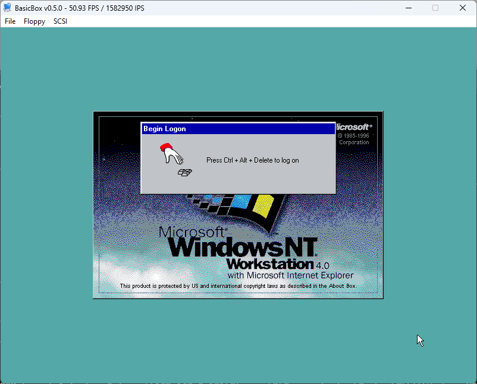
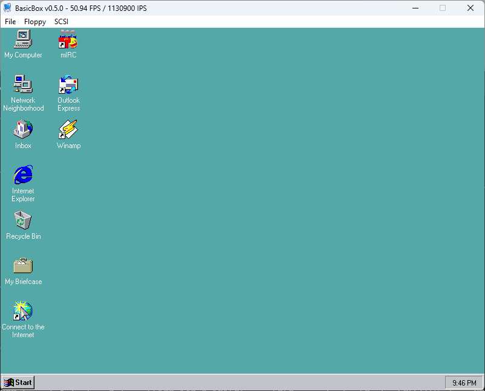
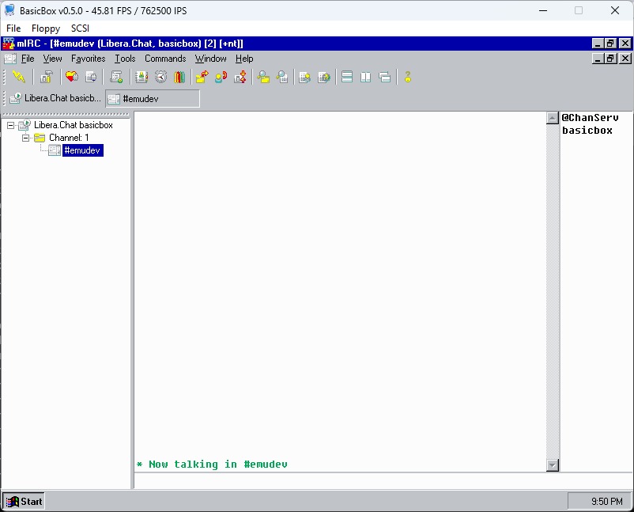
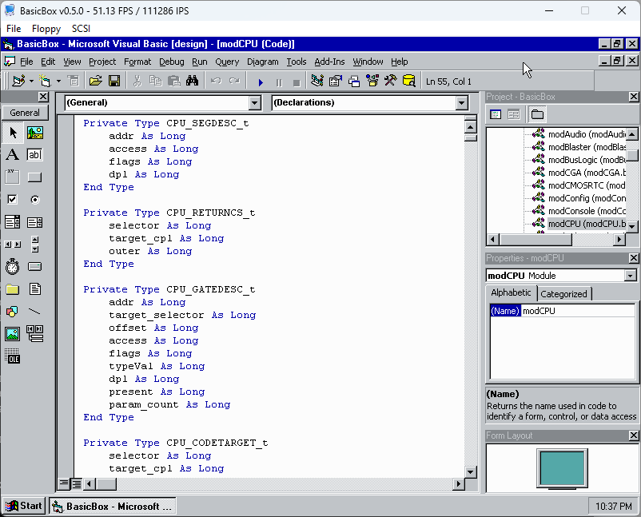
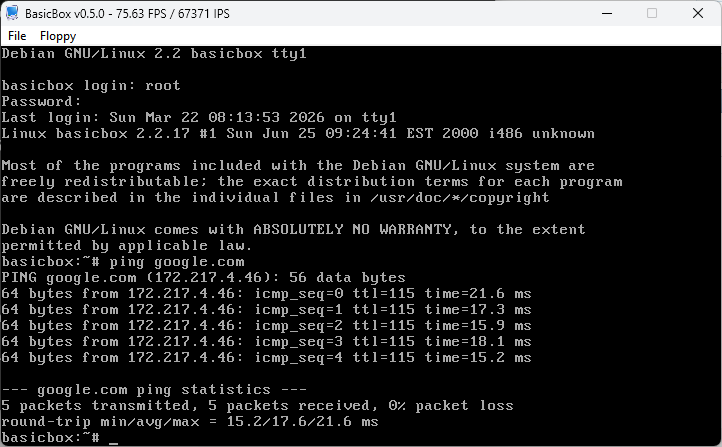
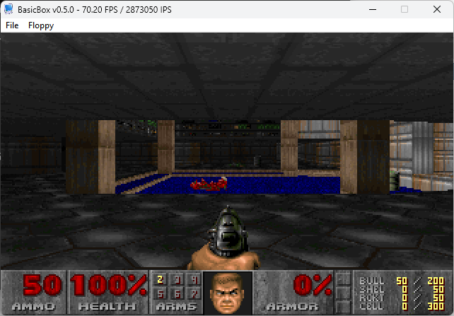
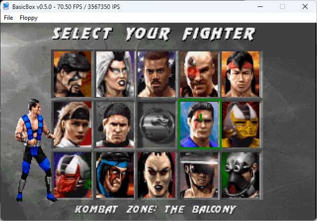
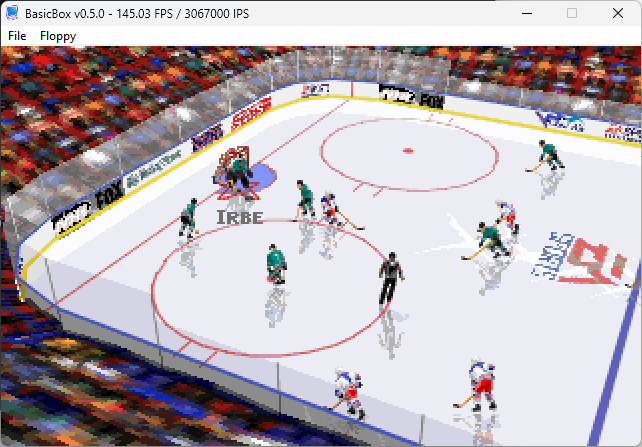
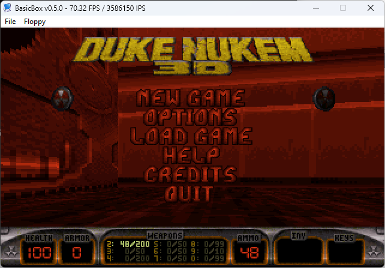

# BasicBox: an x86 PC emulator written in Visual Basic 6

### About

BasicBox is an x86 PC emulator written entirely in Visual Basic 6. Emulated CPU support is at a 486 baseline, but includes a few later opcodes such as CMOV and RDTSC.

It can run Windows NT 4.0, Linux and DOS. Slowly. You are going to want a very modern CPU with high IPC and high clock speed. My i9-13900KS runs things okay. My Ryzen 7 4800H laptop, much less so.

Why would I write an x86 emulator in VB6? It seemed like a fun project. I grew up with VB6, and I still like to do stupid stuff like this in it sometimes. This is really a port of my other emulator, PCulator, which is written in C.

### Current status

It's fairly functional. Tested working OSes are Windows NT 4.0, various older Debian GNU/Linux distributions, and DOS. It can run many DOS games as well. Again, slowly. Games that needed a real 486 are not generally going to be very playable in BasicBox, if at all. This whole project is really more of a proof-of-concept, showing that it's at least possible to emulate a full PC in VB6.

### Usage notes:

- BasicBox currently requires you to configure the guest machine from the command line. Launch with -h for a list of options. I plan to have a GUI configuration utility soon.
- Click in the window or press Ctrl-F11 to "grab" the mouse. Ctrl-F11 releases the grab.
- Ctrl-F12 injects a Ctrl-Alt-Delete sequence to the guest OS.
- Windows NT 4.0 doesn't like my IDE controller, it blue screens during startup unless using a SCSI hard disk. DOS and Linux seem to work fine with IDE.
- There is a "-video et4000" option but it's buggy and has issues, so I don't recommend using it yet. Stick with the default "stdvga" card for now.
- It uses a real 486 era BIOS, so just like back in the day you need to configure IDE disks in BIOS setup.
- Have a lot of patience. :)

### Features

- 486 CPU (plus a few extra instructions... let's just call it an "enhanced 486" for now)
- 387-class FPU (ported from Tiny386)
- ATA/IDE controller
- BusLogic BT-545S SCSI controller with both hard disk and CD ISO support (ported from 86Box)
- Floppy controller (A bit broken, works in DOS. Linux and NT 4 don't really like it.)
- VGA graphics
- Microsoft-compatible serial mouse
- NE2000 network card (ported from Bochs) -- requires winpcap/npcap to be installed.
- Sound Blaster (my implementation) + OPL3 (NukedOPL ported to VB6)

### To do:

- SPEED OPTIMIZATION! As much as possible at least.
- Get Windows 2000 working.
- Fix IDE issues.
- Finish user-mode networking module so pcap isn't required.
- Get ET4000 working correctly.
- Some GUI config tool.
- Fix various other bugs

### Some screenshots

